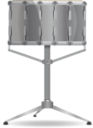

# 🥁 Drum Kit Web App

An interactive **Drum Kit** built using **HTML, CSS, and JavaScript** that lets users play drum sounds either by clicking on images or pressing corresponding keyboard keys.

It’s a simple yet engaging project that demonstrates event handling, DOM manipulation, and audio playback in JavaScript.

---

## 🚀 Features

* 🎯 Play drum sounds using **keyboard keys (W, A, S, D, J, K, L)**
* 🖱️ Click on drum images to trigger sounds
* 🎨 Clean and responsive UI
* ⚡ Instant audio feedback with smooth interaction
* 🔊 Realistic drum sound effects

---

## 🛠️ Tech Stack

* **HTML5** – Structure
* **CSS3** – Styling and layout
* **JavaScript (Vanilla JS)** – Functionality and interactivity

---

## 📂 Project Structure

```
Drum-Kit/
│
├── images/
│   ├── crash.png
│   ├── kick.png
│   ├── snare.png
│   ├── tom1.png
│   ├── tom2.png
│   ├── tom3.png
│   └── tom4.png
│
├── sounds/
│   ├── crash.mp3
│   ├── kick-bass.mp3
│   ├── snare.mp3
│   ├── tom-1.mp3
│   ├── tom-2.mp3
│   ├── tom-3.mp3
│   └── tom-4.mp3
│
├── index.html
├── styles.css
├── script.js
└── README.md
```

---

## 🎮 How to Use

1. Open the project in your browser:

   ```
   index.html
   ```

2. Play the drums by:

   * Pressing keys: **W, A, S, D, J, K, L**
   * OR clicking on the drum images

---

## 💡 How It Works

* Event listeners detect **keyboard presses** and **mouse clicks**
* Each key/image is mapped to a specific sound file
* JavaScript plays audio using the `Audio` object
* Visual feedback (animations) enhances interaction

---

## 📸 Preview



---

## 🌱 Future Improvements

* Add **mobile touch gestures**
* Improve animations and transitions
* Add **volume control**
* Add **record & playback feature**
* Create different drum kits (rock, jazz, electronic)

---

## 🙌 Acknowledgements

Built to strengthen core frontend skills and explore JavaScript interactivity.

---

## 👨‍💻 Author

Made with ❤️ by **Akash**

---

## ⭐ Show Your Support

If you like this project:

* ⭐ Star the repository
* 🍴 Fork it
* 🛠️ Contribute improvements
