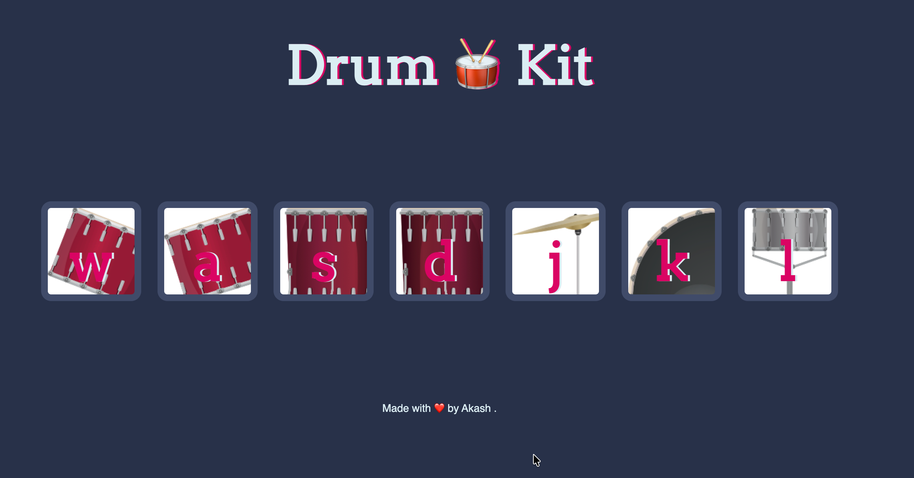

<p align="center">
  <h1>🥁 Drum Kit — Interactive Web Experience</h1>
</p>

<p align="center">
  
  
  
</p>

<p align="center">
  <b>Turn your keyboard into a rhythm instrument.</b><br/>
  Play, experiment, and feel the feedback — instantly.
</p>

---

## ✨ What This Is

A minimal yet expressive **Drum Kit web app** where every interaction—keypress or click—produces both **sound and visual feedback**.

It’s a small project, but it captures something essential:
**how interfaces should respond to human input—immediately and intuitively.**

---

## 🎬 Experience

⭐ **Experience the website live here:**  
👉 https://drum-kit-9l2y.vercel.app/

⭐ **Read the Linkden Post:**  
👉https://www.linkedin.com/feed/update/urn:li:activity:7445677720644243456/?originTrackingId=Hmlft0HRZQGXTVYM1Dx0sA%3D%3D

<p align="center">
  
</p>

---

## 📂 Project Structure

```
Drum-Kit/
│
├── images/
│   ├── crash.png
│   ├── kick.png
│   ├── snare.png
│   ├── tom1.png
│   ├── tom2.png
│   ├── tom3.png
│   └── tom4.png
│
├── sounds/
│   ├── crash.mp3
│   ├── kick-bass.mp3
│   ├── snare.mp3
│   ├── tom-1.mp3
│   ├── tom-2.mp3
│   ├── tom-3.mp3
│   └── tom-4.mp3
│
├── index.html
├── styles.css
├── script.js
└── README.md
```

---

## 🎯 Core Interactions

- Press keys → **W A S D J K L**
- Click buttons → **Instant drum sounds**
- Visual feedback → **Press animation + glow**
- Response time → **Near-instant (no lag)**

Every input is mapped deliberately, keeping the experience tight and predictable.

---

## 🧠 How It Works

At its core, the app listens and responds:

- Captures **keyboard events** and **click events**
- Maps each input to a **specific sound file**
- Plays audio using JavaScript’s native `Audio` API
- Triggers a short-lived **animation state** for tactile feedback

This is event-driven UI in its simplest, cleanest form.

---

## 🛠️ Tech Stack

| Layer      | Role                  |
| ---------- | --------------------- |
| HTML5      | Structure             |
| CSS3       | Layout + animations   |
| JavaScript | Logic + interactivity |

No frameworks. No dependencies. Just fundamentals.

---

## ⚙️ Local Setup

```bash
git clone https://github.com/your-username/drum-kit.git
cd drum-kit
open index.html
```

Runs entirely in the browser—no build step required.

---

## 🌱 Where This Can Go

This project is intentionally simple—but extensible:

- Add **record & playback**
- Introduce **multiple drum kits**
- Improve with **touch gestures (mobile)**
- Add **sound visualizers / wave effects**
- Deploy as a **full interactive music tool**

---

## 👨‍💻 Author

**Akash Wakade**
Built with a focus on clean interaction and responsive UI.

---

## ⭐ If You Found This Interesting

Star it, fork it, or build on top of it.
Small projects like this are where strong frontend instincts are formed.

---

## 🎵 Final Note

> Good interfaces respond.
> Great interfaces _feel_.

---
